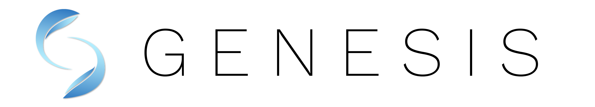
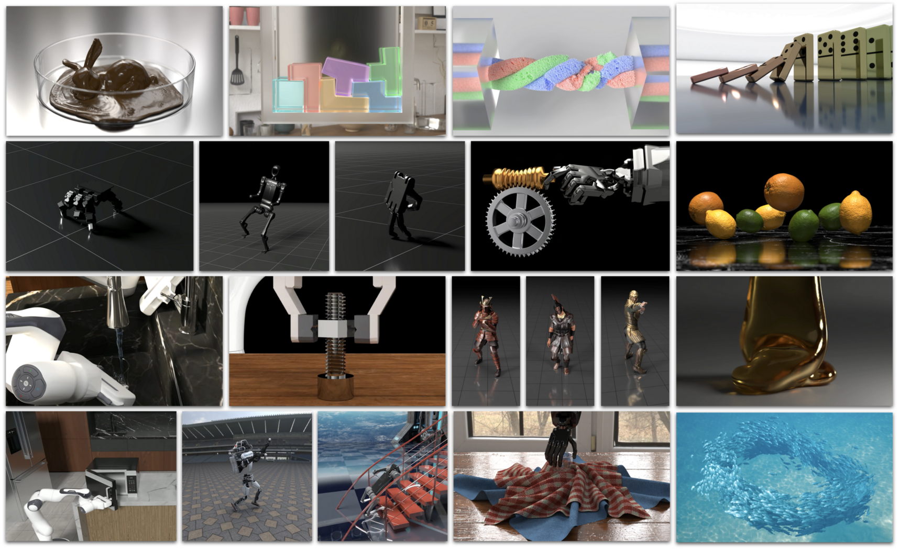

[](https://pypi.org/project/genesis-world/)
[](https://pypi.org/project/genesis-world/)
[](https://github.com/Genesis-Embodied-AI/Genesis/issues)
[](https://github.com/Genesis-Embodied-AI/Genesis/discussions)
[](https://discord.gg/nukCuhB47p)
<a href="https://drive.google.com/uc?export=view&id=1ZS9nnbQ-t1IwkzJlENBYqYIIOOZhXuBZ"></a>

[](./README.md)
[](./README_FR.md)
[](./README_KR.md)
[](./README_CN.md)
[](./README_JA.md)

# Genesis

## 🔥 새 소식

- [2024-12-25] 레이 트레이싱 렌더러를 지원하는 [docker](#docker) 추가
- [2024-12-24] [제네시스 기여](https://github.com/Genesis-Embodied-AI/Genesis/blob/main/.github/CONTRIBUTING.md) 가이드라인 추가

## Table of Contents

1. [Genesis란?](#genesis란)
2. [주요 특징](#주요-특징)
3. [빠른 설치](#빠른-설치)
4. [Docker](#docker)
5. [문서](#문서)
6. [Genesis에 기여하기](#genesis에-기여하기)
7. [지원](#지원)
8. [라이선스 및 감사의 글](#라이선스-및-감사의-글)
9. [관련 논문](#관련-논문)
10. [인용](#인용)

## Genesis란?

Genesis는 *로보틱스/임베디드 AI/물리 AI* 애플리케이션을 위해 설계된 범용 물리 플랫폼입니다. 그리고 다음과 같은 기능을 제공합니다:

1. 폭넓은 재료와 물리 현상을 시뮬레이션할 수 있도록 처음부터 다시 구축된 **범용 물리 엔진**.
2. **가볍고**, **매우 빠르며**, **파이썬 친화적이고**, **사용자 친화적인** 로보틱스 시뮬레이션 플랫폼.
3. 강력하고 빠른 **실사 렌더링 시스템**.
4. 사용자의 자연어 설명을 다양한 형태의 데이터로 변환하는 **생성형 데이터 엔진**.

Genesis의 목표:

- **물리 시뮬레이션의 진입 장벽을 낮춰** 누구나 로보틱스 연구에 접근할 수 있도록 합니다. [사명 선언문](https://genesis-world.readthedocs.io/en/latest/user_guide/overview/mission.html)을 확인하세요.
- 단일 프레임워크로 **통합된 다양한 물리 솔버**를 통해 최상의 정확도로 물리적 세계를 재현합니다.
- **데이터 생성을 자동화**하여 사람의 수고를 줄이고 데이터 플라이휠이 스스로 순환하도록 합니다.

프로젝트 페이지: <https://genesis-embodied-ai.github.io/>

## 주요 특징

- **속도**: 단일 RTX 4090에서 Franka 로봇 팔을 시뮬레이션하는 경우, 4300만 FPS 이상(실시간보다 430,000 배 빠름).
- **크로스 플랫폼**: Linux, macOS, Windows에서 실행 가능 및 다양한 연산 백엔드(CPU, Nvidia/AMD GPU, Apple Metal) 지원.
- **다양한 물리 솔버 통합**: Rigid body, MPM, SPH, FEM, PBD, Stable Fluid.
- **폭넓은 재료 모델**: 강체, 액체, 기체, 변형 가능한 오브젝트, 얇은 쉘 오브젝트 및 입상 재료의 시뮬레이션 및 결합.
- **다양한 로봇 호환성**: 로봇 팔, 보행 로봇, 드론, *소프트 로봇* 및 다양한 파일 형식(`MJCF (.xml)`, `URDF`, `.obj`, `.glb`, `.ply`, `.stl` 등) 로드 지원.
- **실사 렌더링**: 네이티브 레이 트레이싱 기반 렌더링.
- **미분 가능성**: Genesis는 완전히 미분 가능하도록 설계되었습니다. 현재 MPM 솔버와 Tool 솔버가 미분 가능하며, 다른 솔버는 향후 버전에서는 강체 및 관절체 솔버를 시작으로 다른 솔버들도 지원할 예정입니다.
- **물리 기반 촉각 시뮬레이션**: 미분 가능한 [촉각 센서 시뮬레이션](https://github.com/Genesis-Embodied-AI/DiffTactile) 출시 예정(버전 0.3.0 예상).
- **사용자 친화성**: 직관적인 설치 및 API로 간편하게 사용 가능.

## 빠른 설치

Genesis는 PyPI를 통해 설치할 수 있습니다:

```bash
pip install genesis-world  # Python >=3.9 필요
```

또한, [공식 설명서](https://pytorch.org/get-started/locally/)에 따라 **PyTorch**를 설치해야 합니다.

최신 버전을 사용하려면 저장소를 복제한 후 로컬에서 설치하세요:

```bash
git clone https://github.com/Genesis-Embodied-AI/Genesis.git
cd Genesis
pip install -e .
```

## Docker

Docker를 사용하여 Genesis를 실행하려면 먼저 Docker 이미지를 빌드하세요:

```bash
docker build -t genesis -f docker/Dockerfile docker
```

그런 다음 Docker 이미지(`/workspace/examples`에 마운트된) 내에서 예제를 실행할 수 있습니다:

```bash
xhost +local:root # 컨테이너가 디스플레이에 접근할 수 있도록 허용

docker run --gpus all --rm -it \
-e DISPLAY=$DISPLAY \
-v /tmp/.X11-unix/:/tmp/.X11-unix \
-v $PWD:/workspace \
genesis
```

## 문서

전체 문서는 [영어](https://genesis-world.readthedocs.io/en/latest/user_guide/index.html)와 [중국어](https://genesis-world.readthedocs.io/zh-cn/latest/user_guide/index.html)로 제공됩니다. 이 문서에는 자세한 설치 단계, 튜토리얼 및 API 참조가 포함되어 있습니다.

## Genesis에 기여하기

Genesis 프로젝트는 오픈 소스 및 협력 프로젝트입니다. 다음을 포함하여 커뮤니티의 모든 형태의 기여를 환영합니다:

- 새로운 기능이나 버그 수정을 위한 **풀 리퀘스트**.
- GitHub Issues를 통한 **버그 리포트**.
- Genesis의 사용성을 향상시키기 위한 **제안**.

자세한 내용은 [기여 가이드](https://github.com/Genesis-Embodied-AI/Genesis/blob/main/.github/CONTRIBUTING.md)를 참조하세요.

## 지원

- GitHub [Issues](https://github.com/Genesis-Embodied-AI/Genesis/issues)를 통해 버그를 보고하고 기능을 요청하세요.
- GitHub [Discussions](https://github.com/Genesis-Embodied-AI/Genesis/discussions)에서 토론에 참여하거나 질문해 보세요.

## 라이선스 및 감사의 글

Genesis 소스 코드는 Apache 2.0 라이선스를 따릅니다.

Genesis 개발은 다음 오픈 소스 프로젝트 덕분에 가능했습니다:

- [Taichi](https://github.com/taichi-dev/taichi): 고성능 크로스 플랫폼 연산 백엔드. Taichi 팀의 기술 지원에 감사드립니다!
- [FluidLab](https://github.com/zhouxian/FluidLab): MPM 솔버 구현 참고.
- [SPH_Taichi](https://github.com/erizmr/SPH_Taichi): SPH 솔버 구현 참고.
- [Ten Minute Physics](https://matthias-research.github.io/pages/tenMinutePhysics/index.html) 및 [PBF3D](https://github.com/WASD4959/PBF3D): PBD 솔버 구현 참고.
- [MuJoCo](https://github.com/google-deepmind/mujoco): 강체 역학 참고.
- [libccd](https://github.com/danfis/libccd): 충돌 감지 참고.
- [PyRender](https://github.com/mmatl/pyrender): 래스터화 기반 렌더러.
- [LuisaCompute](https://github.com/LuisaGroup/LuisaCompute) 및 [LuisaRender](https://github.com/LuisaGroup/LuisaRender): 레이 트레이싱 DSL.

## 관련 논문

Genesis는 다양한 기존 및 진행 중인 연구의 최첨단 기술을 하나의 시스템으로 통합하는 대규모 프로젝트입니다. 다음은 Genesis 프로젝트에 어떤 방식으로든 기여한 논문들의 대략적인 목록입니다:

- Xian, Zhou, et al. "Fluidlab: A differentiable environment for benchmarking complex fluid manipulation." arXiv preprint arXiv:2303.02346 (2023).
- Xu, Zhenjia, et al. "Roboninja: Learning an adaptive cutting policy for multi-material objects." arXiv preprint arXiv:2302.11553 (2023).
- Wang, Yufei, et al. "Robogen: Towards unleashing infinite data for automated robot learning via generative simulation." arXiv preprint arXiv:2311.01455 (2023).
- Wang, Tsun-Hsuan, et al. "Softzoo: A soft robot co-design benchmark for locomotion in diverse environments." arXiv preprint arXiv:2303.09555 (2023).
- Wang, Tsun-Hsuan Johnson, et al. "Diffusebot: Breeding soft robots with physics-augmented generative diffusion models." Advances in Neural Information Processing Systems 36 (2023): 44398-44423.
- Katara, Pushkal, Zhou Xian, and Katerina Fragkiadaki. "Gen2sim: Scaling up robot learning in simulation with generative models." 2024 IEEE International Conference on Robotics and Automation (ICRA). IEEE, 2024.
- Si, Zilin, et al. "DiffTactile: A Physics-based Differentiable Tactile Simulator for Contact-rich Robotic Manipulation." arXiv preprint arXiv:2403.08716 (2024).
- Wang, Yian, et al. "Thin-Shell Object Manipulations With Differentiable Physics Simulations." arXiv preprint arXiv:2404.00451 (2024).
- Lin, Chunru, et al. "UBSoft: A Simulation Platform for Robotic Skill Learning in Unbounded Soft Environments." arXiv preprint arXiv:2411.12711 (2024).
- Zhou, Wenyang, et al. "EMDM: Efficient motion diffusion model for fast and high-quality motion generation." European Conference on Computer Vision. Springer, Cham, 2025.
- Qiao, Yi-Ling, Junbang Liang, Vladlen Koltun, and Ming C. Lin. "Scalable differentiable physics for learning and control." International Conference on Machine Learning. PMLR, 2020.
- Qiao, Yi-Ling, Junbang Liang, Vladlen Koltun, and Ming C. Lin. "Efficient differentiable simulation of articulated bodies." In International Conference on Machine Learning, PMLR, 2021.
- Qiao, Yi-Ling, Junbang Liang, Vladlen Koltun, and Ming Lin. "Differentiable simulation of soft multi-body systems." Advances in Neural Information Processing Systems 34 (2021).
- Wan, Weilin, et al. "Tlcontrol: Trajectory and language control for human motion synthesis." arXiv preprint arXiv:2311.17135 (2023).
- Wang, Yian, et al. "Architect: Generating Vivid and Interactive 3D Scenes with Hierarchical 2D Inpainting." arXiv preprint arXiv:2411.09823 (2024).
- Zheng, Shaokun, et al. "LuisaRender: A high-performance rendering framework with layered and unified interfaces on stream architectures." ACM Transactions on Graphics (TOG) 41.6 (2022): 1-19.
- Fan, Yingruo, et al. "Faceformer: Speech-driven 3d facial animation with transformers." Proceedings of the IEEE/CVF Conference on Computer Vision and Pattern Recognition. 2022.
- Wu, Sichun, Kazi Injamamul Haque, and Zerrin Yumak. "ProbTalk3D: Non-Deterministic Emotion Controllable Speech-Driven 3D Facial Animation Synthesis Using VQ-VAE." Proceedings of the 17th ACM SIGGRAPH Conference on Motion, Interaction, and Games. 2024.
- Dou, Zhiyang, et al. "C· ase: Learning conditional adversarial skill embeddings for physics-based characters." SIGGRAPH Asia 2023 Conference Papers. 2023.
- ...

이 외에도 다양한 연구가 진행 중입니다.

## 인용

연구에서 Genesis를 사용하는 경우, 다음을 인용해 주세요:

```bibtex
@software{Genesis,
  author = {Genesis Authors},
  title = {Genesis: A Universal and Generative Physics Engine for Robotics and Beyond},
  month = {December},
  year = {2024},
  url = {https://github.com/Genesis-Embodied-AI/Genesis}
}
